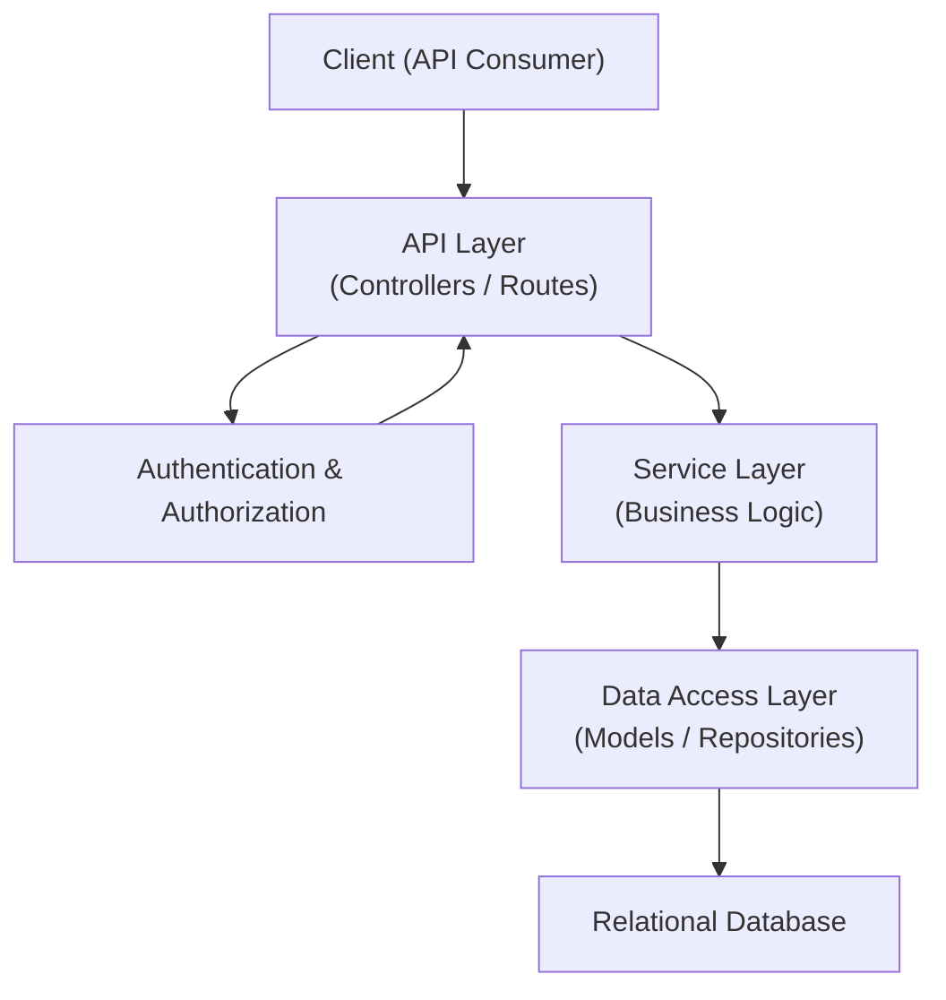

# Architecture Overview

## System Purpose

This system is an **Inventory Management Backend** designed as a **single, modular monolith**.
Its primary purpose is to serve as a **reference implementation** that can be reproduced across multiple backend frameworks in order to compare architecture, developer experience, performance, and maintainability in a fair and structured way.

The system supports common inventory-related business operations such as:

- User authentication and authorization
- Product and inventory management
- Stock movement tracking
- Order processing
- Reporting and aggregation

While the domain is realistic, the system is intentionally constrained to keep architectural decisions clear and comparable.

---

## Core Goals

The design of this system is driven by the following goals:

1. **Clarity**
   - Make architectural boundaries explicit and understandable.
   - Ensure that each responsibility has a clear place in the system.

2. **Scalability (Logical, Not Physical)**
   - Support growth in features and complexity without degrading maintainability.
   - Focus on modular scalability rather than horizontal scaling.

3. **Comparability Across Frameworks**
   - Ensure the same architectural intent can be implemented consistently in different backend frameworks.
   - Avoid framework-specific shortcuts that would distort comparison.

4. **Approachability**
   - Enable developers and reviewers to understand the system without deep domain knowledge.
   - Favor explicit design over implicit behavior.

---

## Target Users

This documentation and system architecture are intended for:

- **Backend Developers**
  Evaluating or learning different backend frameworks and architectural patterns.

- **Technical Reviewers / Architects**
  Assessing trade-offs between frameworks, tooling, and design decisions.

- **Decision Makers**
  Comparing backend platforms for long-term maintainability and development velocity.

The system is not optimized for end users, frontend consumption, or production-scale deployment.

---

## What This System Is NOT

To avoid ambiguity, this system explicitly does **not** include:

- Microservices architecture
- Event-driven or message-based systems
- Distributed transactions
- Asynchronous job orchestration
- Domain-driven design with bounded contexts
- Framework-specific abstractions exposed at the architecture level

These exclusions are intentional to keep the focus on **core backend fundamentals**.

---

## High-Level Components

At a conceptual level, the system is composed of the following components:

- **API Layer**
  Handles HTTP requests, input validation, authentication enforcement, and response formatting.

- **Service Layer**
  Encapsulates business logic and rules. Services coordinate operations across entities and repositories.

- **Data Access Layer**
  Responsible for persistence, queries, and transactions. Abstracted behind repositories or models.

- **Infrastructure Layer**
  Shared concerns such as configuration, logging, caching, security utilities, and database connections.

Each component has a clearly defined responsibility and a one-directional dependency flow.

---

## Deployment Model

The system is deployed as a **single backend service**:

- One application process
- One database
- One runtime environment

All modules run within the same deployment unit.
Inter-module communication occurs via in-process calls, not network requests.

This deployment model simplifies:

- Development and debugging
- Performance measurement
- Architectural comparison

---

## Technology Stack Summary

While individual implementations may vary by framework, the conceptual stack includes:

- HTTP-based REST API
- Relational database
- Token-based authentication
- In-process caching
- Centralized configuration

Specific technologies are documented elsewhere and intentionally excluded from this architectural overview.

---

## Design Constraints

The architecture operates under the following constraints:

- **Single Codebase**
  All functionality resides in one repository and one runtime.

- **Explicit Boundaries**
  Modules must not access each other’s internal state directly.

- **Predictable Control Flow**
  Requests follow a consistent path from API → Service → Data Access.

- **Repeatability**
  The architecture must be reproducible across different backend frameworks with minimal reinterpretation.

These constraints ensure the system remains understandable, comparable, and maintainable.

---

## Summary Diagram

At a high level, request flow follows this structure:

Cross-cutting concerns such as authentication, caching, logging, and error handling are applied consistently across all layers.

---
