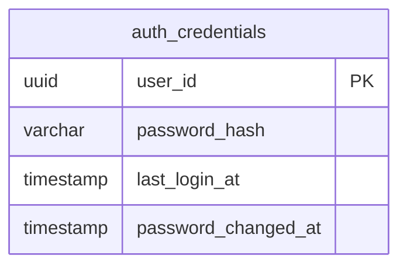

# Table: auth_credentials

## Entity Definition

```mermaid
erDiagram
    auth_credentials {
        uuid user_id PK
        varchar password_hash
        timestamp last_login_at
        timestamp password_changed_at
    }
```

## Columns

- **user_id**: References `users.id`.
- **password_hash**: Secure hash of the user's password.
