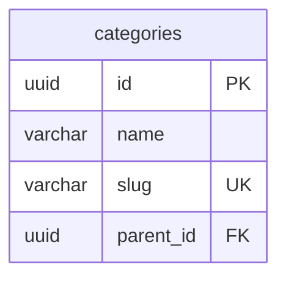

# Table: categories

## Entity Definition

```mermaid
erDiagram
    categories {
        uuid id PK
        varchar name
        varchar slug UK
        uuid parent_id FK
    }
```

## Columns

- **parent_id**: Self-reference for hierarchical categories.
