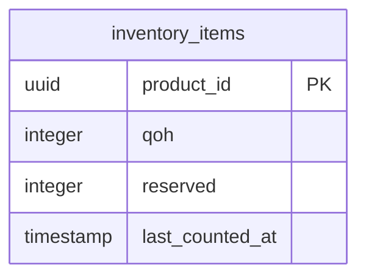

# Table: inventory_items

## Entity Definition

```mermaid
erDiagram
    inventory_items {
        uuid product_id PK
        integer qoh
        integer reserved
        timestamp last_counted_at
    }
```

## Columns

- **product_id**: Reference to `products`.
- **qoh**: Quantity on Hand (cached/derived value).
