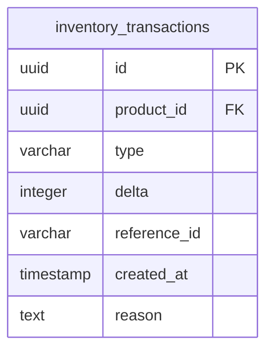

# Table: inventory_transactions

## Entity Definition

```mermaid
erDiagram
    inventory_transactions {
        uuid id PK
        uuid product_id FK
        varchar type
        integer delta
        varchar reference_id
        timestamp created_at
        text reason
    }
```

## Columns

- **type**: Transaction type (IN, OUT, ADJ).
- **delta**: Quantity change magnitude (positive or negative).
