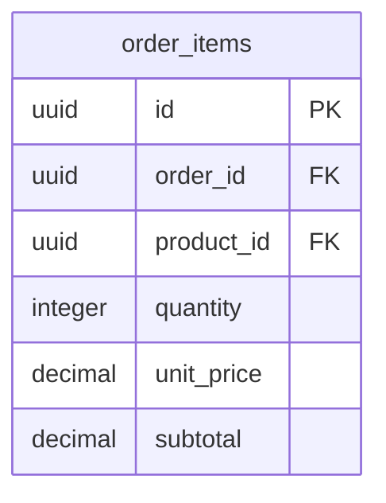

# Table: order_items

## Entity Definition

```mermaid
erDiagram
    order_items {
        uuid id PK
        uuid order_id FK
        uuid product_id FK
        integer quantity
        decimal unit_price
        decimal subtotal
    }
```

## Columns

- **unit_price**: Price frozen at time of purchase.
