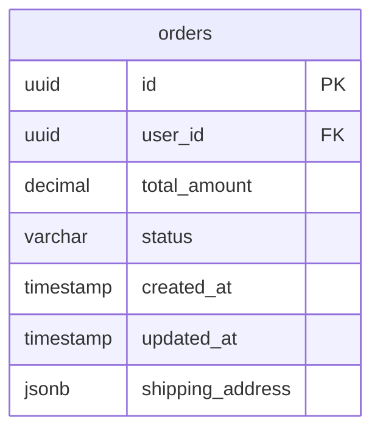

# Table: orders

## Entity Definition

```mermaid
erDiagram
    orders {
        uuid id PK
        uuid user_id FK
        decimal total_amount
        varchar status
        timestamp created_at
        timestamp updated_at
        jsonb shipping_address
    }
```

## Columns

- **status**: Order state (PENDING, PAID, SHIPPED, CANCELLED).
