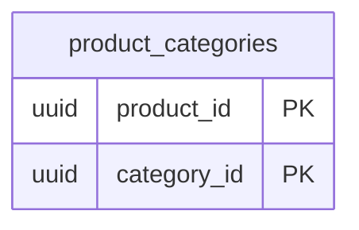

# Table: product_categories

## Entity Definition

```mermaid
erDiagram
    product_categories {
        uuid product_id PK
        uuid category_id PK
    }
```

## Columns

- **product_id**: Reference to `products`.
- **category_id**: Reference to `categories`.
