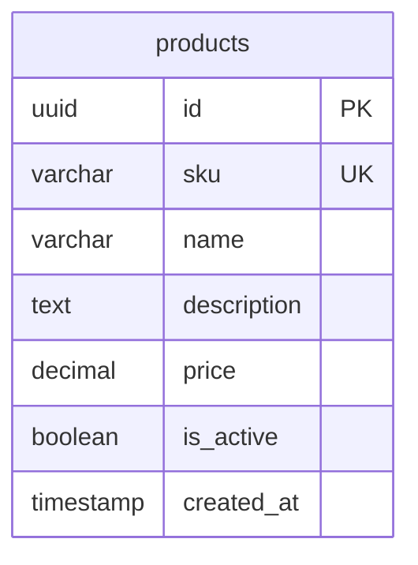

# Table: products

## Entity Definition

```mermaid
erDiagram
    products {
        uuid id PK
        varchar sku UK
        varchar name
        text description
        decimal price
        boolean is_active
        timestamp created_at
    }
```

## Columns

- **sku**: Stock Keeping Unit, unique business identifier.
- **price**: Base selling price in system currency.
