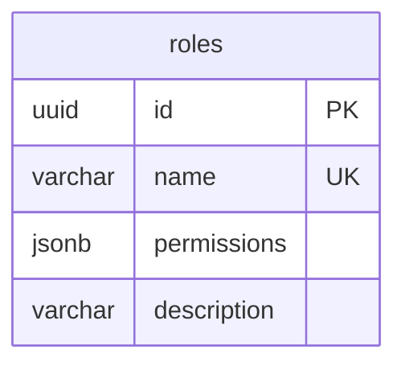

# Table: roles

## Entity Definition

```mermaid
erDiagram
    roles {
        uuid id PK
        varchar name UK
        jsonb permissions
        varchar description
    }
```

## Columns

- **id**: Unique identifier (UUID).
- **name**: Role name (e.g., "admin", "user").
- **permissions**: JSON list of allowed action strings.
