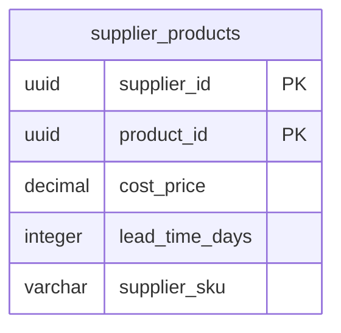

# Table: supplier_products

## Entity Definition

```mermaid
erDiagram
    supplier_products {
        uuid supplier_id PK
        uuid product_id PK
        decimal cost_price
        integer lead_time_days
        varchar supplier_sku
    }
```

## Columns

- **cost_price**: Unit cost from this supplier.
