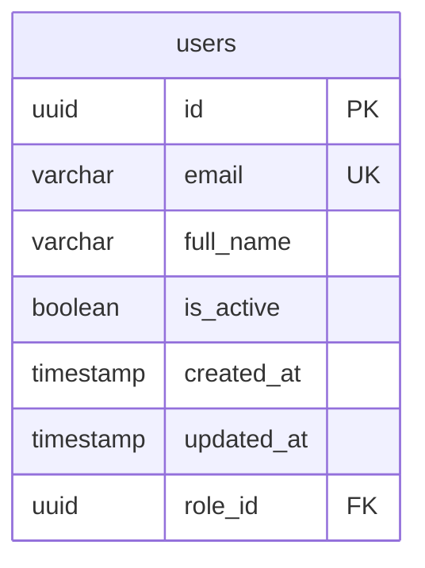

# Table: users

## Entity Definition

```mermaid
erDiagram
    users {
        uuid id PK
        varchar email UK
        varchar full_name
        boolean is_active
        timestamp created_at
        timestamp updated_at
        uuid role_id FK
    }
```

## Columns

- **id**: Unique identifier (UUID).
- **email**: User's email address, must be unique.
- **role_id**: Reference to the assigned role.
